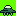

# Maak een game voor de Fri3d badge met GB Studio

Code, voorbeelden en slides bij de workshop: “Maak een game voor de badge met GB Studio” op [Fried camp 2024](https://fri3d.be.

## Sprites om te downloaden

- 
- 
- 
- 
- 
- 
- 
- 

## Piskel om pixel art te maken

- https://www.piskelapp.com/
- [GB Studio kleurenpalet voor Piskel](downloads/gb-studio-piskel-sprites-palette-ca735a4ca7c2924dc00e3dc698186e9f.gpl)
