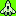
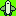
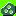

# Maak een game voor de Fri3d badge met GB Studio

Code, voorbeelden en slides bij de workshop: “Maak een game voor de badge met GB Studio” op [Fried camp 2024](https://fri3d.be.

## GB Studio

- https://www.gbstudio.dev/
- [Download GB Studio](https://chrismaltby.itch.io/gb-studio)
- [GB Studio documentatie](https://www.gbstudio.dev/)

## Sprites/Backgrounds om te downloaden

- Spaceship alternative 1: 
- Spaceship alternative 1: 
- Spaceship alternative 1: 
- Spaceship alternative 1: 
- Spaceship alternative 1: 
- Asteroid alternative 1: 
- Asteroid alternative 2: 
- Laser: 
- [Achtergrond](downloads/background.png)
- [Game Over](downloads/game-over.png)

## Extra tools

### Piskel om pixel art te maken

- https://www.piskelapp.com/
- [GB Studio kleurenpalet voor Piskel](downloads/gb-studio-piskel-sprites-palette-ca735a4ca7c2924dc00e3dc698186e9f.gpl)

### Tiled map editor om backgrounds te maken

- https://www.mapeditor.org/
- Gebruik voor GB Studio: [Pixel Pete | GB Studio Tutorial 2: Sprites](https://youtu.be/HaTt2ROGV3E?si=esMQKPBAV8lk4NIt)
