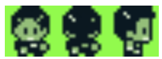

# Sprites en achtergronden

Van pijltjes en blokjes naar een echt ruimteschip.

---

## Wat we bouwen

Betere afbeeldingen voor:

- Player sprite
- Asteroid sprite
- Laser sprite
- Background

---
layout: two-cols-ldr
---

## Sprites en spritesheets

::left::

Sprite {.eyebrow.sage}

- Kleine afbeelding in pixel art
- Stelt spelers en actoren voor in games

::right::

Spritesheet {.eyebrow.maple}

- Grotere afbeelding die alle statussen van de sprite bevat
- Bijvoorbeeld vooraanzicht, achteraanzicht, zijaanzicht

---
layout: image-side
image: /sprite-colors.png
fit: contain
eyebrow: Sprites
---

## Sprites in GB Studio

- png
- 16 x 16 pixels
- 3 kleuren + transparant (fluo groen)

---

## Spritesheets in GB Studio

- png
- 16n x 16 pixels (n = aantal sprites in sheet)

{.max-h-20}

---

## Sprites en spritesheets maken

- Image editor
- Bijvoorbeeld [piskelapp.com](https://www.piskelapp.com/)
- Mini-demo — meer info: spreek Wannes straks aan
- <a href="https://raw.githubusercontent.com/lars-derichter/gb-asteroids/refs/heads/master/downloads/gb-studio-piskel-sprites-palette.gpl" download>Piskel palet voor GB Studio</a>

---

## Sprites importeren

- Verplaats je sprites naar de subfolder assets/sprites van je project folder

_Het folder icoon 📁 rechtsbovenaan GB Studio brengt je naar je project folder._

---

## Sprites aanpassen

- Selecteer je scene
- Klik op afbeelding bij Player Sprite Sheet en kies je afbeelding
- Klik op Sprite Sheet bij Launch Projectile en kies je afbeelding
- Selecteer de Asteroid 1 actor
- Klik op afbeelding bij Sprite Sheet en kies je afbeelding

---
layout: image-side
image: /background-colors.png
fit: contain
eyebrow: Achtergronden
---

## Achtergronden in GB Studio

- PNG van minimaal 160 x 144 pixels
- Opgedeeld in tiles van 8 x 8 pixels, die herhaald kunnen worden
- Maximaal 192 unieke tiles per scene (geheugenbesparing)
- In subfolder assets/backgrounds van je project folder

---

## Achtergrond instellen

- Asteroids heeft slechts 1, kleine achtergrond nodig
- Selecteer Scene >> Klik op afbeelding bij Background
- Selecteer de juiste achtergrond
