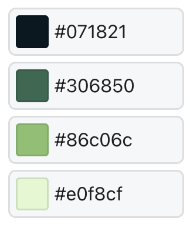

# Maak je eigen game met GB Studio

---

## Voorstellen

- Lars De Richter: lector graduaat Programmeren aan Thomas More Hogeschool (SKW & Antwerpen)
- Wannes De Richter: leerling STEM aan Novaplus Antwerpen

===

## Installatie

- Download en installeer de versie van GB Studio voor jouw besturingssysteem: https://chrismaltby.itch.io/gb-studio.
- Deze tutorial is gemaakt met v4.0.2 en zou dust met alle 4.x versies moeten werken.

===

## Sample project

- Open GB Studio
- Kies new
- Verwijs bij Path naar je Desktop (of een andere makkelijke locatie)
- Project name: sample
- Template: het kleurrijke sample project
- Create project

---

---

<!-- .slide: data-background-image="images/gb-studio-overview.jpg" data-background-size="contain" -->

---

### Navigator

- linksboven
- laat je snel switchen tussen scenes en onderdelen

---

### Scene overview

- centraal
- grafische weergave van je scenes en hun onderdelen

---

### Editor sidebar

- rechts
- instellingen van geselecteerd onderdeel

---

### Editor tools

- Dingen selecteren, toevoegen, verwijderen …

===

## v0.0.0

- default sprites
- speler beweegt enkel horizontaal
- speler kan schieten
- 1 asteroide:
  - respawnt op random plek wanneer onderaan
  - respawnt op random plek wanneer geraakt

---

### New, blank project

---

### Test het spel

- Play button rechtsbovenaan
- Player is een pijl
- Kan in 4 richtingen bewegen

**Na elke verandering testen❗️**

---

### Player instellen

- Start position:
  - X: 9 : midden horizontaal (18 posities: 0 - 17; 0 helemaal links)
  - Y: 16 : onderaan (18 posities: 0 -17; 0 helemaal bovenaan)
- Direction: 🔼 (speler kijkt naar boven)

---

### Verticale beweging uitschakelen

- On Init (= bij het begin van de scene):
  - Add Event (= hoe je het spel dingen laat doen)
  - Joypad Input (we willen knoppen aanpassen)
  - Attach Script to button (we willen de functie van de knoppen aanpassen)
  - 🔼 en 🔽 selecteren
  - Override default button action aanduiden (we willen het normale gedrag aanpassen)
  - On press leeg laten (normaal zou je hier een actie zetten, maar we willen dat er niets gebeurt)

---

### A/B knoppen instellen

Nu willen we de A en B knoppen aanpassen: probeer zelf!

---

### Schietfunctie

- Druk op Add Event bij On Press
- Kies Actor
- Kies Launch Projectile
- Direction: Activeer enkel 🔼

---

### Asteroide toevoegen

- Druk op + bij Tools
- Kies Actor (dingen in je spel die iets doen zijn actors)
- Klik ergens bovenaan om de Actor te plaatsen
- Verander naam Actor 1 in Asteroid 1

---

### Asteroide laten bewegen

- On Update
- Add Event
- Actor Move Relative
- X: 0 (geen horizontale beweging)
- Y: 1 (verticaal één stap naar onder)
- Bovenaan Speed ½ (niet te snel beginnen)

---

### Random variabele maken

- probleem: Asteroide vertrekt telkens van dezelfde plek
- X-positie moet random getal tussen 0 en 17 worden:
  - On Init >> Add Event
  - Variable >> Math Functions
  - Variable: Local 0 >> hernoem naar Asteroid1_X (hover over de naam en ✎)
  - Value: Random
  - Min Value: 0; Max Value: 17

---

### Asteroide op random positie zetten

- Add Event
- Actor >> Set Actor Position
- Actor: Self
- X: $Asteroid1_X (eerst op # drukken)
- Y: 0

(je zal merken dat het niet helemaal random is)

---

### Asteroide respawnt wanneer onderaan

- Meten of Asteroide onderaan is:
  - On Update
  - Add Event >> Actor >> If Actor at Position
  - X: $Asteroid1_X (verandert niet); Y: 17 (onderste positie)
- If deel -> zelfde als Asteroide op Random positie zetten
- Else deel: Self Move Relative hierin slepen

---

### Asteroide respawnt wanneer geraakt

- On Hit >> Group 3 (= Collision Group van Projectile)
- Collision Group: 1 (= Collide With van Projectile)
- Add Event >> Display Dialogue:
  - Hit (of Geraakt of …)
- Add Event >> Actor >> Deactivate Actor
  - Actor: Self (Asteroid 1)

---

- Add Event >> Timer >> Wait
  - Duration: 0.5 (halve seconde wachten)
- Zelfde als Asteroide op Random positie zetten (tip gebruik copy event en paste event)
- Add Event >> Actor >> Activate Actor
  - - Actor: Self (Asteroid 1)

===

## v0.1.0

- betere afbeeldingen:
  - Player sprite
  - Asteroid sprite
  - Laser sprite
  - Background

---

### Sprites en spritesheets

- **sprite:**
  - kleine afbeelding in pixel art
  - spelers en actoren voorstellen in games
- **spritesheet:**
  - grotere afbeelding die alle statussen van de sprite bevat (bijv. vooraanzicht, achteraanzicht, zijaanzicht)

---

### Sprites in GB Studio

- png
- 16 x 16 pixels
- 3 kleuren + transparant (fluo groen)

---

### Spritesheets in GB Studio

- png
- 16n x 16 pixels (n = aantal sprites in sheet)

---

### Sprites en spritesheets maken

- image editor
- bijv. https://www.piskelapp.com/
- mini-demo (meer info: spreek Wannes straks aan)

---

### Sprites importeren

- Verplaats je sprites naar de subfolder assets/sprites van je project folder
- **Tip:** het folder icoon 📁 rechtsbovenaan GB Studio brengt je naar je project folder

---

### Sprites aanpassen

- Selecteer je scene
- Klik op afbeelding bij Player Sprite Sheet en kies je afbeelding
- Klik op Sprite Sheet bij Launch Projectile en kies je afbeelding
- Selecteer de Asteroid 1 actor
- Klik op afbeelding bij Sprite Sheet en kies je afbeelding

---

### Achtergronden in GB Studio

- PNG van minimaal 160x144 pixels
- Achtergrond is opgedeeld in tiles van 8x8 pixels, die herhaald kunnen worden
- Maximaal 192 unieke tiles per scene (geheugenbesparing)
- In subfolder assets/backgrounds van project folder
- 4 kleuren (geen transparantie)

---

### Achtergrond instellen

- Asteroids heeft slechts 1, kleine achtergrond nodig
- Selecteer Scene >> Klik op afbeelding bij Background
- Selecteer de juiste achtergrond

===

## v0.2.0

- Player heeft 3 levens
- Botsing met Asteroide:
  - 1 leven eraf
  - Shake Camera
  - Deactivate and respawn Asteroid
  - Dialogue: You have … lives
- Game Over bij 0 levens

---

### 3 levens bij begin

- Selecteer Scene
- Bij On Init
- Add Event >> Variables >> Variable Set To Value
- Variable: Local 0: hernoem naar Lives
- Value: 3

---

### Leven eraf bij botsing

- Selecteer Scene
- Bij On Player Hit >> Group 1 (= Collision Group van Asteroid 1)
- Add Event >> Variables >> Variable Decrement by 1
- Variable: Lives

---

### Shake Camera

- Add Event >> Camera >> Camera Shake

---

### Display lives

- Add Event >> Dialogue & Menus >> Display Dialogues
- Text: You have $Lives Lives

---

### Asteroid deactiveren

- **Probleem:** Als we Asteroid niet deactiveren: multiple hits
- **Oplossing:**
  - Selecteer Asteroid 1 >> On Hit >> Player
  - Voeg deactivate en respawn code toe

---

### Game Over scene

- Bewaar game-over.png in folder assets/backgrounds
- Druk op + bij Tools
- Selecteer Scene
- Klik in de Scene overview
- Klik op afbeelding bij background en selecteer de juiste
- Hernoem je scene naar Game Over (bovenaan op Scene 2 klikken)

---

### Game Over bij 0 levens

- Ga terug naar de Asteroid collision
- Add Event >> Control Flow >> If
- Condition: Lives
- == : 0

---

- Add Event (in het If block)
- Scene >> Change Scene
- Scene: Game Over
- Verplaats het respawnen naar het Else block

---

## Optimalisaties

- **Pobleem:** Player op het scherm
- Bij On Init
- Add Event >> Actor >> Hide All Sprites

---

- **Probleem:** We geraken niet uit Game Over
- Add Event >> Joypad Input >> Attach Script to Button
- Selecteer Start
- Add Event >> Scene >> Change Scene
- Scene: Scene 1 (of Game)
- X: 9
- Y: 16
- Direction: 🔼

---

- **Probleem:** Actor blijft hidden
- In Game scene bij On Init: Add Event >> Actor >> Show All Sprites

---

- **Probleem:** Hit blijft verschijnen
- Dialogue Event verwijderen

---

- **Probleem:** You have 0 lives is overbodig bij Game Over
- Verplaatsen naar Else sectie van If-blok

---

## v0.3.0

- Levens tonen
- Score bijhouden en tonen bij Game Over

---

### Heart 1 op scherm toevoegen

- Add Actor (rechtsbovenaan)
- X: 18; Y: 1
- Pin to screen: 📌
- Hernoem naar Heart 1
- Zet image naar hartje (Eerst in sprites folder plaatsen)

---

### Heart 2 & 3

- Copy Paste (telkens wat meer naar links)
- Pas namen aan: Heart 2 en Heart 3

---

### Hartjes verwijderen wanneer geraakt

- Kan met 2 extra If-blokken
- Maar properder: Switch (we doen andere dingen voor verschillende waarden van 1 variabele)
- Bij On Player Hit: Add Event >> Control Flow >> Switch
- Variable: $Lives
- Number of options: 2
- Pas Whens aan: 2, 1

---

- Bij When 2: Add Event >> Actor >> Hide Actor
- Actor: Heart 3

---

Bij When 1: denk zelf eens na

---

Bij Else: sleep het event van het If-blok naar hier (Game Over)

---

Verwijder oorspronkelijk if-event (we zien onze levens nu met de hartjes)

---

### Score bijhouden

- Hernoem Links Onder Variable 0 naar Score (rechtsklik >> rename)
- Globale variabele want op verschillende plekken nodig (verschillende actoren en scenes)

### Score bij begin op 0 zetten

- Game Scene >> On Init >> Add Event
- Variables >> Variable Set To Value
- Variable: Score
- Value: 0

---

### Score optellen

- Bij Asteroid 1 >> On Hit >> Group 3
- Add Event >> Variables >> Math Functions
- Variable: Score
- Operation: Add
- Value: Value: 100
- Sleep dit event tot net na Deactivate Self

---

### Score weergeven

- Bij Game Over Scene >> On Init
- Add Event >> Dialogue & Menus >> Display Dialogue
- Text: Your Score\n$Score
- (\n is nieuwe lijn)

---

### Eventuele uitbreidingen

- Leventjes in 1 Actor met Spritesheet
- Score weergeven in de scene met een HUD:

zie README voor links naar tutorials

---

## v0.4.0 Levels

- Snellere Asteroide
- Extra Asteroides

---

### Plaats levelcode

- We moeten alle code ivm levels in de On Update routine van een actor zetten. Meest logische keuze: Asteroid 1
- We zullen meerdere levels hebben, afhankelijk van de Score -> Switch is hier geschikt voor
- Bij Asteroid 1 >> On Update: Add Event >> Control Flow >> Switch
- Variable: Score

---

### Level 2: Asteroide versnellen

- Na 4 rake hits (Score: 400) versnellen we
- Eerste When: Value: 400
  - Add Event >> Set Actor Movement Speed
  - Actor: Self (Asteroid 1)
  - Speed: Speed 1

---

### Level 3: Extra Asteroide

- Copy-Paste Asteroid 1
- Er is nu wel een variabele Asteroid1_X wat stom is:
  - dit is een lokale variabele en dus automatisch onzichtbaar voor de andere Asteroiden
  - we werken graag netjes -> we passen dit bij beide Asteroides aan
- Sprite Sheet eventueel aanpassen
- Switch statement met Score verwijderen (alle level stuff op Asteroid 1)

---

### Extra Asteroide deactiveren en activeren

- Scene >> On Init: Actor deactiveren (je weet hoe)
- In het Switch Statement bij Asteroid 1:
  - 2de When: 700
  - Add Event >> Actor >> Activate Actor
  - Actor: Asteroid 2

---

### Extra Levels

- Je kan Switch waarden bijmaken
  - Je kan één of meerdere Asteroiden bijmaken
  - Je kan één of meer Asteroiden versnellen

---

## Spel exporteren

- Druk rechtsbovenaan op het export icoon
- Kies export ROM
- GB Studio opent de folder met bestanden
- Het .gb bestand bevat je gecompileerde spel

---

## Spel op badge zetten

- Via de micro SD kaart (makkelijkst)
- Via hotspot:
  - RetroGo openen op Badge
  - X
  - Wifi Opties
  - Wifi Access point
  - Verbind je laptop met deze hotspot
  - Surf naar: http://192.168.4.1/
  - Je kan de bestanden op de badge beheren

---

## Extra tip

Zet best geen elementen helemaal in de hoeken van je scherm, omwille van de afgeronde hoeken van het badge scherm. Je zal merken dat Heart 1 niet helemaal zichtbaar is en ook de score is moeiljk leesbaar.

---

## Bedankt

- Bedankt voor jullie aandacht
- Presentatie, downloads en alle info op https://github.com/lars-derichter/gb-asteroids
- lars.derichter@gmail.com
- wannes.derichter@gmail.com

Vergeet niet om te blijven hacken! Try, Fail, Try Again, Fail Better!
